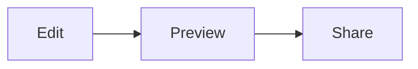

Last April I wrote about an [offline code editor]() — a stripped-down Monaco editor that stays in the browser and does not send your files anywhere. That post still describes the core: syntax highlighting, language detection, themes, format-on-demand, and `Ctrl+S` to download.

Two things were missing. I could not see Markdown or HTML as I typed, and I had no way to show someone else the buffer without sending a file. The offline claim was also a bit generous: the page loaded, then switching Python or HTML still pulled tokenizers from the CDN. I went back and closed those gaps.

Try it at [editor.sanjaysingh.net](https://editor.sanjaysingh.net). Source is on [GitHub](https://github.com/sanjaysingh/editor).

## Live preview

Open a `.md`, `.html`, or `.svg` file (or set the language in the dropdown) and a preview pane appears. Cycle **split**, **preview only**, and **editor only** with the toolbar button or `Ctrl+Shift+M`. The last mode is remembered.

**Markdown** is rendered locally — headings, emphasis, tables, task lists, fenced code, and the usual GFM bits. No extra Markdown library; the renderer escapes user text and only allows `http(s)`, `mailto`, and `#` links.

**Mermaid** diagrams work inside fenced `mermaid` blocks:

````md

````

Mermaid is loaded with the rest of the editor assets on first open, so diagrams still render after you go offline. Invalid diagrams show the source plus an error instead of a blank pane.

**HTML and SVG** render in a sandboxed iframe. Scripts, event handlers, and `javascript:` URLs are stripped, and the frame gets a CSP that blocks script execution. SVG is detected even when the language is set to HTML or XML.

The preview follows the editor theme (dark, light, high contrast).

## Live Share

The original editor was a solo tool. Live Share is optional: click the signal icon, and you get a session key (`ABC-234`), an encryption key (`123-456`), and a URL.

Viewers open the URL, enter the encryption key, and get a **read-only** copy of your editor — content, cursor, language, and preview included. You keep typing; they follow along. Stop the session from the same menu and they see that it ended.

Content is encrypted in the browser (AES-GCM) before it leaves. A small Cloudflare Worker and Durable Object only relay ciphertext. The session key gets you into the room; the encryption key is what actually unlocks the text, and it is never sent to the server.

That is the one place the editor talks to the network after load. If you never start a session, the page stays local.

## Truly offline

The original post said the editor works offline once the page loads. That was only true for whatever language you opened with. Changing the dropdown still fetched Monaco language packs and workers from the CDN.

Every supported language — tokenizers, workers, and Mermaid — now loads when the app opens. After that the network is locked. Switching from Markdown to Python to C# to SQL does not touch the network. Preview stays local. Live Share is the only later exception, and only if you turn it on.
